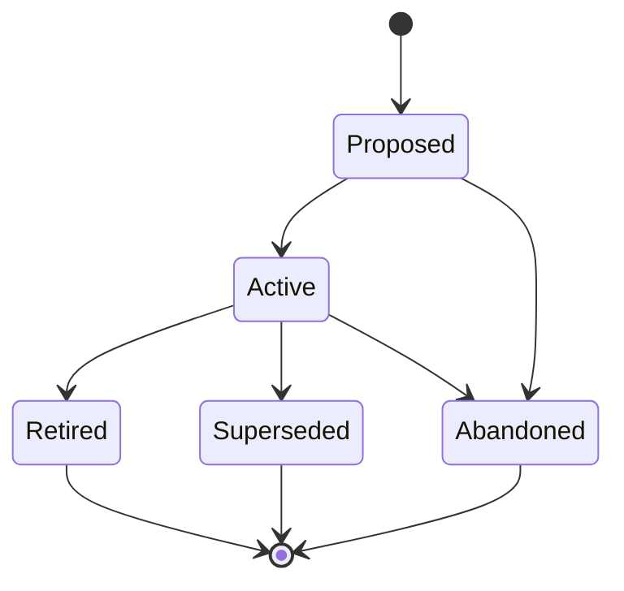

# ADRs (ADR-NNN)

**Template:** [adr-template.md.template](adr-template.md.template)

**Lifecycle track: Standing**

Follow **Michael Nygard's ADR format**: each ADR records a single architectural decision with its context, the decision itself, alternatives considered, and consequences. The format is deliberately lightweight — one decision per document, written in short prose, not a formal specification.

- **Directory structure:** `docs/adr/<Phase>/(ADR-NNN)-<Title>.md` — each ADR is a single Markdown file placed in the subdirectory matching its current lifecycle phase. Phase subdirectories: `Proposed/`, `Active/`, `Retired/`, `Superseded/`.
  - Example: `docs/adr/Active/(ADR-001)-Subtree-Split-Distribution-Model.md`
  - When transitioning phases, **move the file** to the new phase directory (e.g., `git mv docs/adr/Proposed/(ADR-003)-Foo.md docs/adr/Active/(ADR-003)-Foo.md`).
  - **Never** store ADRs flat in `docs/adr/` with phase tracked only in frontmatter — the directory structure must reflect the phase.
- ADRs are cross-cutting: they link to all affected artifacts but are not owned by any single one.
- ADRs are NOT for descriptive or explanatory architecture content. If the content describes "how the system works" without presenting a decision between alternatives, it belongs as an architecture overview supporting doc in the Vision folder — not as an ADR.
- Use the Proposed phase while investigation (Spikes) is still in progress or when the recommendation is formed and ready for review. Move to Active when the decision is adopted.
