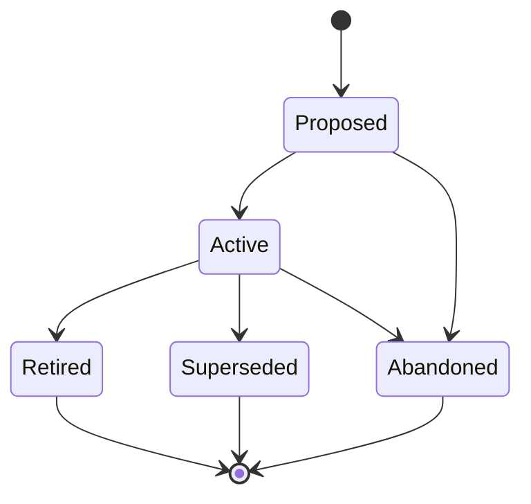

# Designs (DESIGN-NNN)

**Template:** [design-template.md.template](design-template.md.template)

**Lifecycle track: Standing**



A design artifact captures the *shape* of a system concern as a standing document that persists across implementation cycles. Designs sit between Journeys (experience narratives) and Specs (implementation). They answer "what does X look like?" — not "how do we build it?" (Spec) or "what is the user's experience narrative?" (Journey).

Designs cover three domains, selected via the `domain` frontmatter field:

| Domain | What it captures | Example |
|--------|-----------------|---------|
| `interaction` (default) | UI/UX interaction layer: screens, states, flows, wireframes, happy/sad paths, UI decisions | "The skill installation flow", "The settings page" |
| `data` | Data architecture: entity models, data flows, schema definitions, storage patterns, evolution rules, invariants | "The artifact metadata schema", "The task tracking data model" |
| `system` | System contracts: API boundaries, behavioral guarantees, integration interfaces, SLAs, error semantics | "The specgraph CLI interface", "The webhook contract" |

When `domain` is omitted, it defaults to `interaction` for backward compatibility.

- **Folder structure:** `docs/design/<Phase>/(DESIGN-NNN)-<Title>/` — always foldered because a single design may contain multiple document types (screen wireframes, flow diagrams, interactive mockup links, annotated screenshots).
  - Example: `docs/design/Active/(DESIGN-003)-Skill-Installation-Flow/`
  - When transitioning phases, **move the folder** to the new phase directory (e.g., `git mv docs/design/Proposed/(DESIGN-003)-Foo/ docs/design/Active/(DESIGN-003)-Foo/`).
  - Phase subdirectories: `Proposed/`, `Active/`, `Retired/`, `Superseded/`.
  - Primary file: `(DESIGN-NNN)-<Title>.md` — the design overview and entry point.
  - Supporting docs: individual screen wireframes, flow diagrams, state machines, annotated mockups, prototype links, asset inventories.
- **Scoping rule:** One Design per cohesive surface within its domain:
  - `interaction`: One Design per interaction surface or workflow. "The skill installation flow" is a Design. "The settings page" is a Design.
  - `data`: One Design per bounded data domain or data product. "The artifact metadata schema" is a Design. "The task tracking data model" is a Design.
  - `system`: One Design per integration boundary or API surface. "The specgraph CLI interface" is a Design. "The webhook contract" is a Design.
  If a Design covers multiple unrelated surfaces, it should be split. The artifact it's linked to sets the natural boundary — a Design linked to an Epic covers that Epic's surface; a Design linked to a Spec is narrower.
- Designs are *cross-cutting reference artifacts* — they link to Epics and Specs via `linked-artifacts` but are not owned by any single one. Multiple artifacts can reference the same Design.
- A Design is "Active" when stakeholders agree it represents the intended interaction. "Superseded" when a newer Design replaces it (link via `superseded-by:` in frontmatter). "Retired" when the interaction surface it describes no longer exists.
- **Diagrams required:** Any Design that describes a workflow, data model, or system interface MUST include a mermaid diagram. The diagram type depends on the domain:
  - `interaction`: Flowchart (`flowchart TD` or `flowchart LR`) showing the decision spine — user choices and paths.
  - `data`: ER diagram (`erDiagram`) showing entities, relationships, and cardinality. Supplement with flowcharts for data flow.
  - `system`: Flowchart showing request/response flow, or sequence diagram (`sequenceDiagram`) for multi-party interactions.
  - **Syntax rules:** Node IDs must be descriptive snake_case (e.g., `detect_env`, `prompt_user`) — never single-letter IDs. All labels must be quoted (`["Label"]`, `|"yes"|`).
  - **Scope:** Optimize for the human visual system: a scannable diagram beats a comprehensive one. Error handling belongs in "Edge Cases" sections, not on the main diagram.
  - **Multiple paths/branches:** Show each as a branch off a decision diamond with essential steps. Don't fully expand each branch.
  - **Complex branches:** If too complex for a few nodes, give it its own diagram in a subsection.
- Designs capture the *shape* of a concern, not the implementation. Implementation details belong in Specs that reference the Design. Architectural decisions with broader implications belong in ADRs.

## Structured references

### `artifact-refs`

Designs may use `artifact-refs` for commit-pinned cross-references with typed relationships:

```yaml
artifact-refs:
  - artifact: SPEC-067
    rel: [aligned]
    commit: abc1234
    verified: 2026-03-19
```

The `rel` field specifies the relationship type (see [relationship-model.md](relationship-model.md) for the vocabulary). Plain informational cross-references that don't need commit pinning should use `linked-artifacts` (v1 flat list) instead.

### `sourcecode-refs`

Designs may reference implementation files via `sourcecode-refs` -- blob-pinned file references that enable staleness detection when source code changes:

```yaml
sourcecode-refs:
  - path: src/components/Button/Button.tsx
    blob: a1b2c3d
    commit: def5678
    verified: 2026-03-19
```

- `path` -- repo-relative file path
- `blob` -- git blob SHA for the referenced file version
- `commit` -- commit hash where this blob was verified
- `verified` -- date of last manual verification

`sourcecode-refs` entries implicitly carry a `describes` relationship -- no explicit `rel` field. A Design "describes" the surface that the source code implements — whether that's UI components (`interaction`), schema files (`data`), or API modules (`system`).

## Design Intent section

The Design Intent section provides stable criteria against which to evaluate whether implementation changes constitute drift or intentional evolution. It contains three structured subsections:

- **Goals** answer "what experience are we trying to create?" — the desired user-facing outcome.
- **Constraints** are machine-checkable or reviewable boundaries that the design must respect.
- **Non-goals** prevent scope creep by explicitly recording what was decided against.

### Write-once convention

Design Intent is established when the DESIGN is created or transitions to Active. It is not updated when the mutable sections (flows, states, screens) evolve. If the intent itself fundamentally changes, Supersede the DESIGN and create a new one.

Write-once is enforced by agent convention, not tooling. The structured format (Goals/Constraints/Non-goals) makes unintentional edits obvious in code review.
