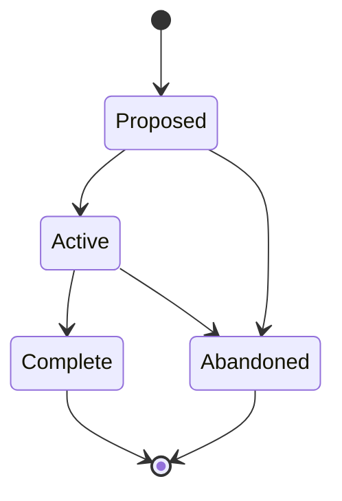

# Epics (EPIC-NNN)

**Template:** [epic-template.md.template](epic-template.md.template)

**Lifecycle track: Container**

A strategic initiative that decomposes into multiple Agent Specs, Spikes, and ADRs. The **coordination layer** between product vision and feature-level work.

- **Folder structure:** `docs/epic/<Phase>/(EPIC-NNN)-<Title>/` — the Epic folder lives inside a subdirectory matching its current lifecycle phase. Phase subdirectories: `Proposed/`, `Active/`, `Complete/`.
  - Example: `docs/epic/Active/(EPIC-001)-Spec-Management/`
  - When transitioning phases, **move the folder** to the new phase directory (e.g., `git mv docs/epic/Proposed/(EPIC-001)-Foo/ docs/epic/Active/(EPIC-001)-Foo/`).
  - Primary file: `(EPIC-NNN)-<Title>.md` — the epic document itself.
  - Supporting docs live alongside it in the same folder.
    - **Architecture overview:** An `architecture-overview.md` in the Epic folder describes the architectural scope of this specific initiative — component boundaries, data flows, and integration points. Must include at least one diagram (mermaid preferred). Recommended diagram types: C4 Container or Component diagram, sequence diagram, data flow diagram, or detailed flowchart. This is narrower than the Vision-level architecture overview — it covers just this Epic's slice of the system.
- An Epic is "Complete" when all child Agent Specs reach "Complete" and success criteria are met.
- **Priority weight (optional):** `priority-weight: high | medium | low` in frontmatter. Overrides the parent Initiative/Vision weight for this Epic and its children. When absent, weight is inherited from the parent chain. This allows sorting Epics within the same Initiative by priority.
- Epics can trace back to journey pain points via `addresses:` in frontmatter (list of `JOURNEY-NNN.PP-NN` IDs). This is informational — it records which pain points the Epic was created to resolve.
- **Tracking requirement:** Swain-do runs on child SPECs, not on the Epic directly. If implementation is requested on an Epic, swain-design decomposes it into children first (see SKILL.md § Execution tracking handoff).
