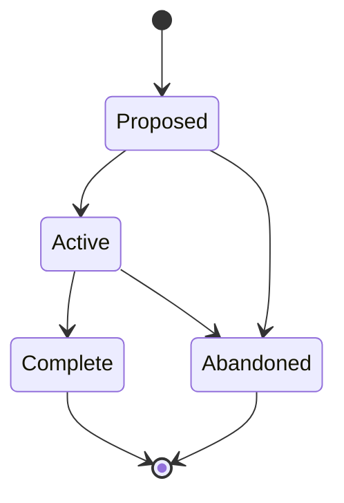

# Initiatives (INITIATIVE-NNN)

**Template:** [initiative-template.md.template](initiative-template.md.template)

**Lifecycle track: Container**

A strategic focus that coordinates multiple Epics toward a shared direction. The **alignment layer** between product vision and epic-level work.

- **Folder structure:** `docs/initiative/<Phase>/(INITIATIVE-NNN)-<Title>/` — the Initiative folder lives inside a subdirectory matching its current lifecycle phase. Phase subdirectories: `Proposed/`, `Active/`, `Complete/`, `Abandoned/`, `Superseded/`.
  - Example: `docs/initiative/Active/(INITIATIVE-001)-Prioritization-Layer/`
  - When transitioning phases, **move the folder** to the new phase directory (e.g., `git mv docs/initiative/Proposed/(INITIATIVE-001)-Foo/ docs/initiative/Active/(INITIATIVE-001)-Foo/`).
  - Primary file: `(INITIATIVE-NNN)-<Title>.md` — the initiative document itself.
  - Supporting docs live alongside it in the same folder.
    - **Architecture overview:** An `architecture-overview.md` in the Initiative folder describes the architectural scope of this strategic focus — component boundaries, data flows, and integration points across the child Epics. Must include at least one diagram (mermaid preferred). Recommended diagram types: C4 Container or Component diagram, sequence diagram, data flow diagram, or detailed flowchart. This is broader than an Epic-level architecture overview — it covers the coordinated architectural patterns across multiple related Epics.
- **Required frontmatter:**
  - `title` — human-readable initiative name
  - `artifact` — INITIATIVE-NNN identifier
  - `track` — always "container"
  - `status` — lifecycle phase (Proposed, Active, Complete, Abandoned, Superseded)
  - `parent-vision` — VISION-NNN parent(s) (required; YAML list, one or more). Initiatives may serve multiple Visions per ADR-009. Priority inheritance uses highest weight among parents unless explicitly overridden. Initiatives without a vision parent are flagged as orphans.
  - `author` — person who created it
  - `created` — ISO-8601 date
  - `last-updated` — ISO-8601 date
- **Optional frontmatter:**
  - `priority-weight` — high/medium/low (inherited from parent Vision unless overridden)
  - `success-criteria` — list of measurable outcomes
  - `depends-on-artifacts` — list of blocking artifacts (VISION-*, EPIC-*, INITIATIVE-*, etc.)
  - `addresses` — list of journey pain points (`JOURNEY-NNN.PP-NN`)
  - `evidence-pool` — reference to supporting research
- An Initiative is "Complete" when all child Epics reach "Complete" and success criteria are met.
- Initiatives can contain child Epics (via `parent-initiative` on the Epic) and standalone Specs (via `parent-initiative` on the Spec).
- Initiatives represent a coordinated strategic focus — multiple related Epics pursuing the same direction.
- The Initiative purpose section is "Strategic Focus" (not "Goal / Objective" like Epics) — it emphasizes direction and intent rather than individual deliverables.
- Initiatives can trace back to journey pain points via `addresses:` in frontmatter (list of `JOURNEY-NNN.PP-NN` IDs). This is informational — it records which pain points the Initiative was created to resolve.
- **Tracking requirement:** Swain-do runs on child EPICs or SPECs, not on the Initiative directly. If implementation is requested on an Initiative, swain-design decomposes it into children first (see SKILL.md § Execution tracking handoff).
