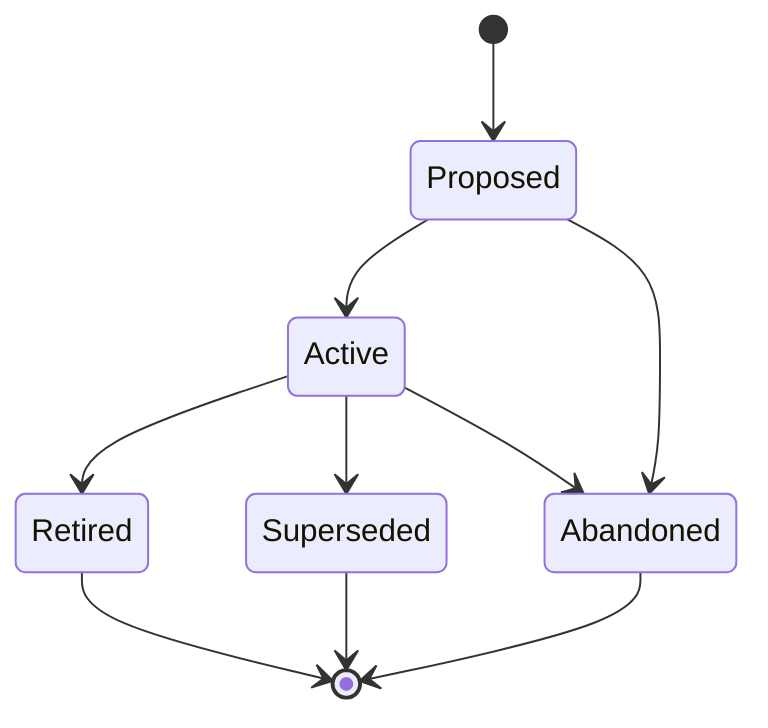
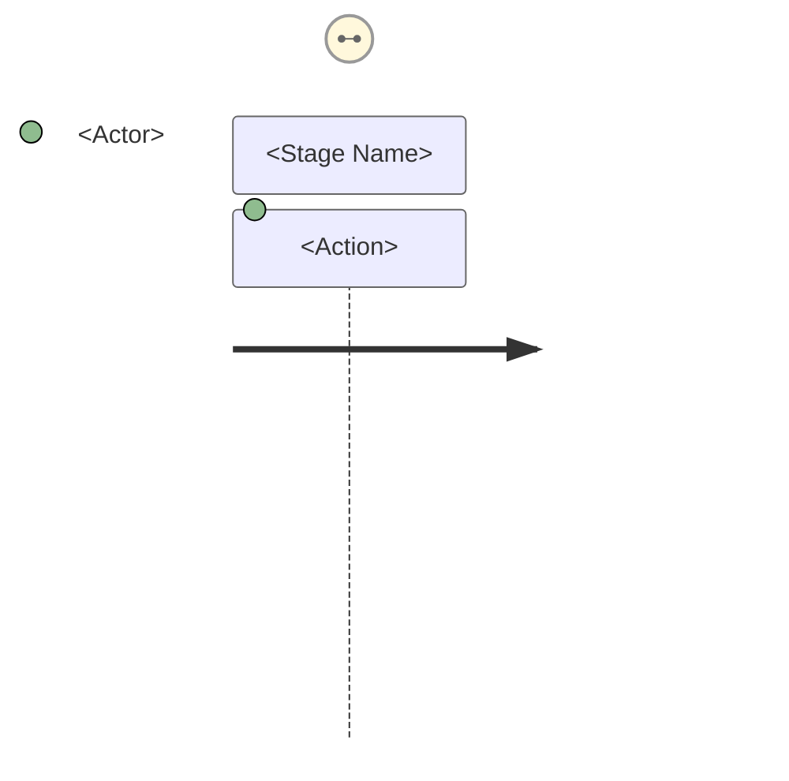
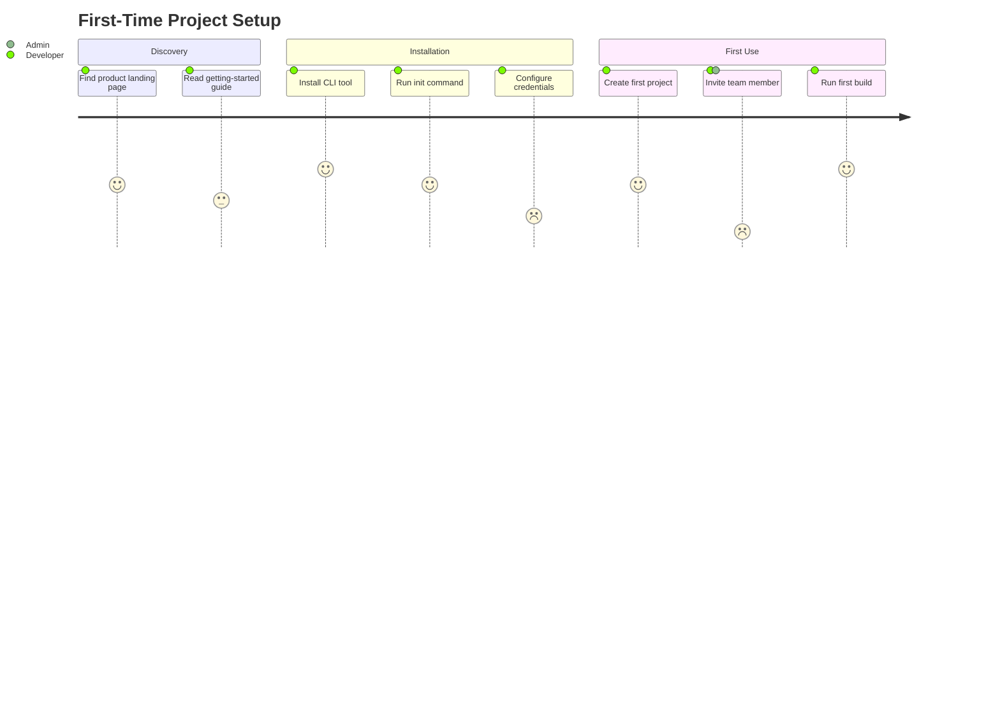

# User Journey (JOURNEY-NNN)

**Template:** [journey-template.md.template](journey-template.md.template)

**Lifecycle track: Standing**



Maps an end-to-end user experience across features and touchpoints. Journeys describe *how a user accomplishes a goal* and surface pain points and opportunities that inform which Epics to create.

- **Folder structure:** `docs/journey/<Phase>/(JOURNEY-NNN)-<Title>/` — the Journey folder lives inside a subdirectory matching its current lifecycle phase. Phase subdirectories: `Proposed/`, `Active/`, `Retired/`, `Superseded/`.
  - Example: `docs/journey/Proposed/(JOURNEY-001)-First-Time-Setup/`
  - When transitioning phases, **move the folder** to the new phase directory (e.g., `git mv docs/journey/Proposed/(JOURNEY-001)-Foo/ docs/journey/Active/(JOURNEY-001)-Foo/`).
  - Primary file: `(JOURNEY-NNN)-<Title>.md` — the journey narrative.
  - Supporting docs: flow charts, interview notes, extended research.
- A Journey is "Active" when its steps and pain points have been confirmed through review or prototype testing.
- Journeys are *discovery artifacts* — they inform Epic and Agent Spec creation but are not directly implemented. They do NOT contain acceptance criteria or task breakdowns.

## Mermaid journey diagram

Every journey MUST include a Mermaid `journey` diagram embedded in the primary file. The diagram is a structured visualization of the narrative — it encodes stages, actions, satisfaction levels, and actors in a single view. Place the diagram immediately after the **Steps / Stages** section.

**Syntax:**

~~~markdown

~~~

**Mapping conventions:**

| Journey element | Mermaid element | Rule |
|-----------------|-----------------|------|
| Steps / stages | `section` blocks | One section per stage, in narrative order |
| Actions within a stage | Task lines | Concise verb phrases (3-6 words) |
| Persona | Actor name | Use the persona's archetype label from its PERSONA-NNN, not the artifact ID |
| System / other actors | Additional actors | Add when a handoff or interaction with another party occurs |

**Satisfaction scores** (1–5 scale):

| Score | Sentiment | Signals |
|-------|-----------|---------|
| 5 | Delighted | Moment of delight, exceeds expectations |
| 4 | Satisfied | Works well, minor friction at most |
| 3 | Neutral | Functional but unremarkable |
| 2 | Frustrated | Noticeable friction — flags a **pain point** |
| 1 | Blocked | Severe friction or failure — flags a critical **pain point** |

Every pain point identified in the narrative MUST appear as a score ≤ 2 task in the diagram, and every score ≤ 2 task MUST have a corresponding pain point in the narrative. This keeps the diagram and narrative in sync.

**Example:**

~~~markdown

~~~

In this example, "Configure credentials" (2) and "Invite team member" (1) surface as pain points — the narrative must describe the corresponding friction and opportunities.

## Pain point IDs

Every pain point in a journey MUST be assigned a stable, unique ID using the format **`JOURNEY-NNN.PP-NN`** — a compound ID scoped to the parent journey.

- IDs are sequential within each journey: PP-01, PP-02, PP-03, ...
- IDs are **stable** — when a pain point is removed, its number is never reused.
- The compound form (`JOURNEY-001.PP-03`) is globally unique across the project and grep-friendly.

**Pain Points Summary table** — every journey MUST include this table in the `## Pain Points` section. The table is the authoritative registry of pain point IDs for the journey.

| ID | Pain Point | Score | Stage | Root Cause | Opportunity |
|----|------------|-------|-------|------------|-------------|

- The `ID` column contains the short form (`PP-01`) within the journey document. The fully qualified form (`JOURNEY-NNN.PP-NN`) is used when referencing pain points from other artifacts.
- Each pain point with a score ≤ 2 in the Mermaid diagram MUST have a row in this table.

**Inline callouts** — in the Steps / Stages narrative, pain points are called out using:

```markdown
> **PP-01:** Description of the friction...
```

The `PP-NN` label in the callout MUST match a row in the Pain Points Summary table.

**Downstream traceability** — Epics and Agent Specs can reference journey pain points via `addresses:` in their frontmatter (list of `JOURNEY-NNN.PP-NN` IDs). This is an informational traceability link, not a blocking dependency.

**Workflow integration:**

- When creating a journey, draft the narrative first, then build the diagram from it. The diagram is a *derived visualization*, not the source of truth — the narrative is.
- When updating a journey (adding stages, revising pain points), update **both** the narrative and the diagram in the same commit.
- When transitioning a journey to Active, confirm that satisfaction scores reflect validated research findings, not initial assumptions. Adjust scores as user feedback dictates.
