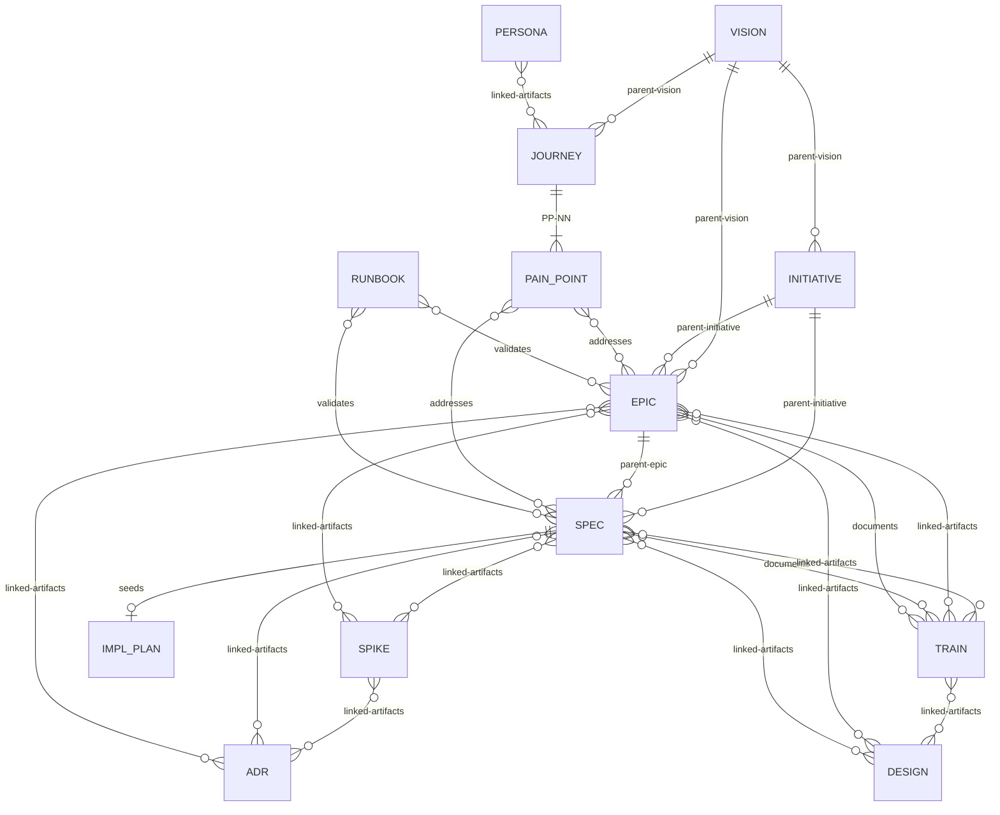

# Artifact Relationship Model



**11 artifact types in three lifecycle tracks:**

| Track | Types | Lifecycle |
|-------|-------|-----------|
| **Implementable** | SPEC | Proposed -> Ready -> In Progress -> Needs Manual Test -> Complete |
| **Container** | INITIATIVE, EPIC, SPIKE | Proposed -> Active -> Complete |
| **Standing** | VISION, JOURNEY, PERSONA, ADR, RUNBOOK, DESIGN, TRAIN | Proposed -> Active -> (Retired \| Superseded) |

**Universal terminal states** (available from any phase): Abandoned, Retired, Superseded.

**Key:** Solid lines (`||--o{`) = mandatory hierarchy. Diamond lines (`}o--o{`) = informational cross-references. SPIKE can attach to any artifact type, not just SPEC. Any artifact can declare `depends-on-artifacts:` blocking dependencies on any other artifact (spikes use `linked-artifacts` only). INITIATIVEs sit between VISION and EPIC — a SPEC may declare `parent-initiative` directly when no intermediate EPIC exists. Per-type frontmatter fields are defined in each type's template.

## `artifact-refs` — typed, commit-pinned cross-references

`artifact-refs` is a structured reference field for commit-pinned cross-references with typed relationships. It replaces the enriched `linked-artifacts` v2 format and is used by TRAIN and DESIGN artifacts (and any artifact needing commit-pinned staleness tracking).

```yaml
artifact-refs:
  - artifact: SPEC-067
    rel: [documents]
    commit: abc1234
    verified: 2026-03-19
```

The flat `linked-artifacts` field (v1) remains for informational cross-references that don't need commit pinning or typed relationships.

### `artifact-refs` relationship vocabulary

| `rel` value | Direction | Meaning | Staleness tracking |
|-------------|-----------|---------|-------------------|
| `linked` | bidirectional | Informational cross-reference (default when `rel` is omitted) | No |
| `documents` | TRAIN → artifact | TRAIN content depends on the artifact's current behavior | Yes — `train-check.sh` diffs pinned commit against HEAD |
| `aligned` | EPIC → DESIGN | Alignment decision recorded between implementation and design | No |

### `sourcecode-refs` — blob-pinned file references

DESIGN artifacts may reference implementation files via `sourcecode-refs`. Each entry carries an implicit `describes` relationship — no explicit `rel` field.

```yaml
sourcecode-refs:
  - path: src/components/Button/Button.tsx
    blob: a1b2c3d
    commit: def5678
    verified: 2026-03-19
```

| Field | Required | Description |
|-------|----------|-------------|
| `path` | yes | Repo-relative file path |
| `blob` | yes | Git blob SHA for the referenced file version |
| `commit` | yes | Commit hash where this blob was verified |
| `verified` | yes | Date of last manual verification |

### Other relationship fields

| Field | Direction | Meaning | Staleness tracking |
|-------|-----------|---------|-------------------|
| `validates` | RUNBOOK → artifact | Runbook verifies the artifact's behavior | No |
| `addresses` | EPIC/SPEC → PAIN_POINT | Artifact resolves a Journey pain point | No |

Tools that parse `artifact-refs` must handle the dict entry format: extract `artifact`, `rel`, `commit`, and `verified` fields. Missing `rel` defaults to `["linked"]`.
