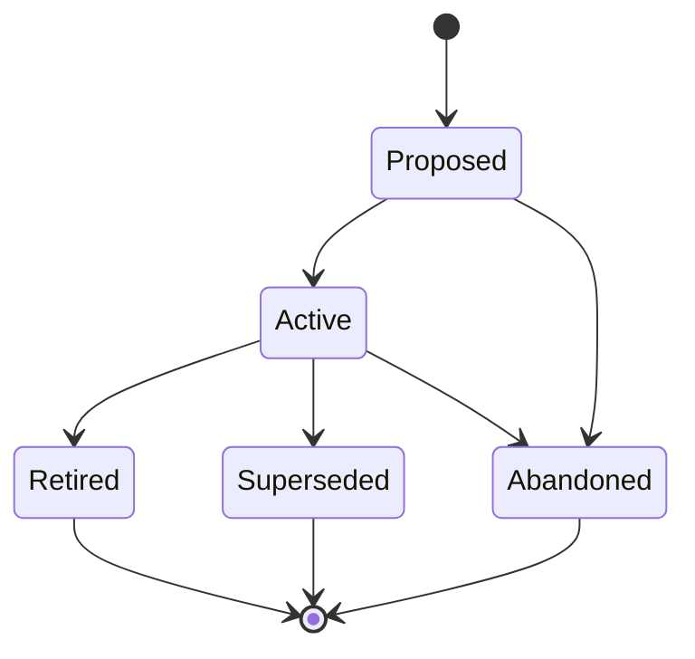

# Runbooks (RUNBOOK-NNN)

**Template:** [runbook-template.md.template](runbook-template.md.template)

**Lifecycle track: Standing**

An executable validation procedure that can be run repeatedly to verify system behavior end-to-end. Runbooks bridge the gap between declarative specs ("did we build the right thing?") and operational confidence ("does the thing work when exercised?").

Two executor modes:
- **Agentic** (`mode: agentic`) — Claude Code executes each step using available tools (Playwright MCP, Bash, etc.). Steps must be deterministic and tool-addressable.
- **Manual** (`mode: manual`) — A human follows the steps. Steps are written as clear instructions with expected outcomes.

Trigger types:
- `on-demand` — Run when explicitly requested.
- `post-deploy` — Run after a deployment to verify the release.
- `on-change` — Run when a specific file, config, or artifact changes.
- `scheduled` — Run on a recurring cadence (e.g., weekly recovery drill).

- **Folder structure:** `docs/runbook/<Phase>/(RUNBOOK-NNN)-<Title>/` — the Runbook folder lives inside a subdirectory matching its current lifecycle phase. Phase subdirectories: `Proposed/`, `Active/`, `Retired/`, `Superseded/`.
  - Example: `docs/runbook/Active/(RUNBOOK-001)-Smoke-Test-Suite/`
  - When transitioning phases, **move the folder** to the new phase directory (e.g., `git mv docs/runbook/Proposed/(RUNBOOK-001)-Foo/ docs/runbook/Active/(RUNBOOK-001)-Foo/`).
  - Primary file: `(RUNBOOK-NNN)-<Title>.md` — the runbook definition.
  - Supporting files: fixtures, expected screenshots, seed data, helper scripts.
- Each step has a numbered **Action** and **Expected Outcome**. Agentic runbooks may include tool hints (e.g., `[playwright]`, `[bash]`).
- A **Run Log** is an append-only table at the bottom of the runbook recording each execution: date, executor, result (Pass/Fail), duration, and notes.
- A Runbook is "Active" when its steps have been validated and it is safe to execute. "Retired" when the procedure is no longer relevant (e.g., the feature it validates was removed).
- Runbooks are cross-cutting: they link to validated artifacts via `validates:` but are not owned by any single one. An optional `parent-epic:` field provides hierarchy when applicable.
