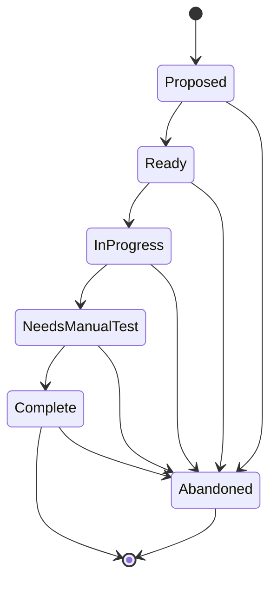

# Agent Specs (SPEC-NNN)

**Template:** [spec-template.md.template](spec-template.md.template)

**Lifecycle track: Implementable**



Follow **spec-driven development** principles: an Agent Spec is a behavior contract — precise enough for an agent to create an implementation plan from, but concise enough to scan in a single pass. It defines external behavior (inputs, outputs, preconditions, constraints), not exhaustive requirements. Supplemental detail comes from linked research.

- **Folder structure:** `docs/spec/<Phase>/(SPEC-NNN)-<Title>/` — the Spec folder lives inside a subdirectory matching its current lifecycle phase. Phase subdirectories: `Proposed/`, `Ready/`, `InProgress/`, `NeedsManualTest/`, `Complete/`.
  - Example: `docs/spec/Ready/(SPEC-002)-Widget-Factory/`
  - When transitioning phases, **move the folder** to the new phase directory (e.g., `git mv docs/spec/Proposed/(SPEC-002)-Foo/ docs/spec/Ready/(SPEC-002)-Foo/`).
  - Primary file: `(SPEC-NNN)-<Title>.md` — the spec document itself.
  - Supporting docs live alongside it in the same folder.
- Should be scoped to something a team (or agent) can ship and validate independently.
- **Type field:** `type: enhancement | bug` (default: unset). Informational metadata — does not affect lifecycle phases. An unset type indicates a standard spec (new capability). When `type: bug`, the template includes additional sections: Reproduction Steps, Severity, and Expected vs. Actual Behavior.
- **Priority field:** `priority-weight: high | medium | low` (optional). When set, overrides the inherited weight from the parent Epic or Initiative for this SPEC only. Omit the field to inherit — behavior is identical to the current cascade (SPEC inherits from the nearest ancestor with a weight). Use a SPEC-level override when a single SPEC within a high-priority Epic is low-value, or vice versa.
- **Parent-epic is optional:** SPECs can exist standalone (no parent epic) for small features, enhancements, or bugs that don't warrant epic-level coordination. Standalone SPECs appear under "Unparented" in specgraph.
- **Tracking requirement:** All Specs carry `swain-do: required` in frontmatter. When a Spec comes up for implementation, invoke the swain-do skill to create a tracked plan before writing code (see SKILL.md § Execution tracking handoff).

## Needs Manual Test phase

The `Needs Manual Test` phase is the acceptance-verification gate between implementation and completion. A Spec enters `Needs Manual Test` when its swain-do implementation plan is complete (all tasks done). It exits `Needs Manual Test` only when every acceptance criterion has documented evidence.

### Entering Needs Manual Test

When all swain-do tasks for a Spec are complete, transition the Spec from `In Progress` to `Needs Manual Test`. Do **not** skip directly to `Complete`.

### Verification table

On entry to `Needs Manual Test`, populate the Spec's **Verification** section. For each acceptance criterion:

1. **Criterion** — copy or paraphrase the Given/When/Then scenario from the Acceptance Criteria section.
2. **Evidence** — the test name, file path, manual check, or demo scenario that proves the criterion is satisfied. Reference specific test functions or files (e.g., `test_widget_export in tests/test_widget.py`).
3. **Result** — one of: `Pass`, `Fail`, or `Skip (reason)`.

Every criterion must have a non-empty Evidence and Result cell before the Spec can transition to `Complete`.

### Verification gate

Before transitioning from `Needs Manual Test → Complete`, run `scripts/spec-verify.sh <artifact-path>`. The script checks that every acceptance criterion has corresponding evidence. Exit 0 = all criteria covered. Exit 1 = gaps found. Address gaps before proceeding.

### Supporting docs

For complex Specs with extensive test evidence (10+ criteria, multi-environment matrices), place detailed results in a `verification-report.md` alongside the Spec in its folder. The Verification table in the Spec should summarize; the report holds the detail.

```
docs/spec/NeedsManualTest/(SPEC-003)-Widget-Factory/
  (SPEC-003)-Widget-Factory.md       ← the spec (with summary Verification table)
  verification-report.md             ← detailed evidence (optional)
```
