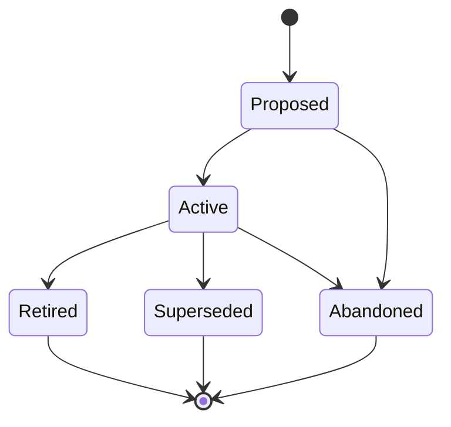

# Training Documents (TRAIN-NNN)

**Template:** [train-template.md.template](train-template.md.template)

**Lifecycle track: Standing**



A training document is structured learning material that teaches humans how to use a feature, workflow, or system. TRAIN artifacts track alongside the artifacts they teach, enabling staleness detection when source artifacts change. They answer "how does a user learn to do X?" — not "how does the system work?" (Spec), "what should the UI look like?" (Design), or "how do I operate this?" (Runbook).

**Train types** (based on [Diataxis framework](https://diataxis.fr/)):
- `how-to` — goal-oriented steps for a specific task, assumes competence (e.g., "How to configure credential scoping")
- `reference` — factual lookup material: descriptive, complete, neutral (e.g., "Artifact type reference")
- `quickstart` — compressed tutorial for time-to-first-success under 10 minutes (e.g., "Your first swain project")

Key Diataxis rule: never mix types in a single document.

- **Folder structure:** `docs/train/<Phase>/(TRAIN-NNN)-<Title>/` — always foldered because a training document may include supporting files (screenshots, diagrams, example configs, exercise files).
  - Example: `docs/train/Active/(TRAIN-001)-Getting-Started-with-Swain/`
  - When transitioning phases, **move the folder** to the new phase directory (e.g., `git mv docs/train/Proposed/(TRAIN-001)-Foo/ docs/train/Active/(TRAIN-001)-Foo/`).
  - Phase subdirectories: `Proposed/`, `Active/`, `Retired/`, `Superseded/`.
  - Primary file: `(TRAIN-NNN)-<Title>.md` — the training document.
  - Supporting files: screenshots, diagrams, example configs, exercise files.
- **Scoping rule:** One TRAIN per cohesive topic or task. A TRAIN's `train-type` determines its structure — do not mix how-to steps with reference tables in the same document. If a TRAIN grows beyond its type, split it.
- TRAINs are *cross-cutting reference artifacts* — they link to Specs, Epics, and Designs via `linked-artifacts` but are not owned by any single one. Use `artifact-refs` with `rel: [documents]` and a commit pin for content-dependent links that need staleness tracking.
- A TRAIN is "Active" when its content accurately reflects the current behavior of the artifacts it teaches. "Superseded" when a newer TRAIN replaces it (link via `superseded-by:` in frontmatter). "Retired" when the feature or workflow it describes no longer exists.
- TRAINs are NOT Runbooks. Runbooks are executable procedures with pass/fail outcomes; TRAINs are educational content with learning objectives. If a document has Steps and Expected Outcomes, it's a Runbook. If it has Learning Objectives and a Summary, it's a TRAIN.
- TRAINs are NOT READMEs, CLAUDE.md, or AGENTS.md. Those are operational configuration for agents and developers. TRAINs are structured learning materials for human operators and users.

## Staleness detection

TRAINs use `artifact-refs` entries with `rel` tags and optional commit pinning for content-dependent references:

```yaml
artifact-refs:
  - artifact: SPEC-067
    rel: [documents]
    commit: abc1234
    verified: 2026-03-19
```

- `rel: [documents]` — content dependency with commit-pinned staleness tracking
- `train-check.sh` reads `artifact-refs` entries with `documents` in `rel`, diffs pinned commit against HEAD for each documented artifact
- Exit 0 = current, Exit 1 = drift found, Exit 2 = git unavailable (graceful degradation)
- Plain string entries in `linked-artifacts` (v1 flat list) remain for informational cross-references — no staleness tracking

## Integration hooks

- **SPEC completion:** When a SPEC transitions to Complete and a TRAIN documents it via `artifact-refs` with `rel: [documents]`, the completion hook nudges the operator to update the existing TRAIN (prefer update over create).
- **EPIC completion:** When an EPIC transitions to Complete with no linked TRAINs, the completion hook suggests creating documentation for the Epic's features.
- **Spike back-propagation (step 4e):** TRAIN artifacts in the same Vision/Initiative scope are included in the sibling scan. Semantic conflicts are surfaced as `IMPLICIT_CONFLICT`.
- **specwatch scan:** Calls `train-check.sh` to detect stale commit pins across all active TRAINs.
- **adr-check:** Validates TRAIN artifacts against active ADRs (same as other artifact types).
