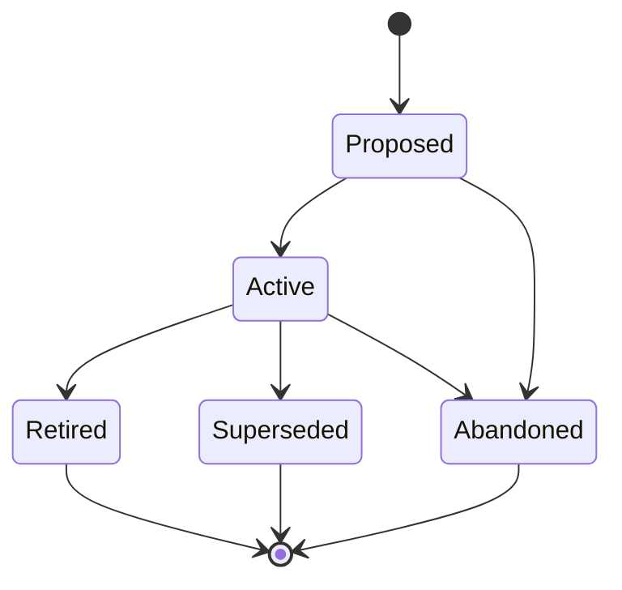

# Product Vision (VISION-NNN)

**Template:** [vision-template.md.template](vision-template.md.template)

**Lifecycle track: Standing**

The highest-level specification artifact. Follow **Marty Cagan's product vision model** (from *Inspired*): a Vision is a short, aspirational narrative describing the future you want to create for your customers. It communicates *why* the product exists, *who* it serves, and *what better state of the world* it enables — and nothing else.

A Vision is NOT a spec, NOT a feature list, NOT a roadmap, NOT a technical architecture document, and NOT a tracking artifact. If content describes *how* the system is built, *what* technologies it uses, *when* things ship, or *which tasks* remain, it belongs in a child artifact (Epic, Agent Spec, ADR, Spike), not the Vision.

## Product type

Before drafting a Vision, ask the user: **"Is this a competitive product or a personal product?"** The answer fundamentally shapes the vision's strategy section and the decomposition that follows.

### Competitive product

A competitive product is intended for a market — it needs users, differentiation, and a defensible position. The vision should address:

- **Competitive moat** — what structural advantage makes this hard to replicate? (Network effects, proprietary data, switching costs, brand, ecosystem lock-in, etc.)
- **Scaling model** — how does this grow beyond early adopters? What changes at 10x, 100x, 1000x users?
- **Market positioning** — who are the incumbents, what gap does this fill, why now?
- **Differentiation** — what does this do that alternatives cannot or will not?

### Personal product

A personal product solves a need for the author (and possibly a small cluster of related users — family, team, friends). The economics are completely different: building from scratch is the *worst* outcome, not the default.

The priority stack for a personal product is:

1. **Find an existing solution** that covers 100% of the need. If one exists, the Vision should document it and close — the best personal product is one you don't have to build.
2. **Glue-code existing solutions** — combine 2-3 existing tools/services/libraries to cover the need. The Vision focuses on the integration surface, not the components.
3. **Build from scratch** — only when options 1 and 2 genuinely fail. The Vision should explain why existing solutions were insufficient (this becomes the "Alternatives Considered" content).

Personal products don't need to scale, don't need competitive moats, and don't need market positioning. They need to be *maintainable by one person* and *solve the actual problem*. The vision should emphasize:

- **Exact problem statement** — what specific friction or gap prompted this?
- **Existing landscape** — what was tried, what came close, what fell short?
- **Build-vs-buy decision** — which tier of the priority stack did we land on, and why?
- **Maintenance budget** — how much ongoing effort is acceptable? (This constrains architectural choices downstream.)

- **Folder structure:** `docs/vision/<Phase>/(VISION-NNN)-<Title>/` — the Vision folder lives inside a subdirectory matching its current lifecycle phase. Phase subdirectories: `Proposed/`, `Active/`, `Retired/`, `Superseded/`.
  - Example: `docs/vision/Active/(VISION-001)-Personal-Agent-Platform/`
  - When transitioning phases, **move the folder** to the new phase directory (e.g., `git mv docs/vision/Proposed/(VISION-001)-Foo/ docs/vision/Active/(VISION-001)-Foo/`).
  - Primary file: `(VISION-NNN)-<Title>.md` — the vision document itself.
  - Supporting docs live alongside it in the same folder. These are NOT numbered artifacts — they are informal reference material owned by the Vision.
    - **Expected:** Every Vision SHOULD include an `architecture-overview.md`. A `roadmap.md` is auto-generated by `chart.sh roadmap --scope` and should not be manually maintained — it is regenerated on every project-wide roadmap refresh.
    - **Optional:** competitive analysis, market research, positioning docs, persona summaries, and other reference material as needed.
- **Architecture overview:** An `architecture-overview.md` in the Vision folder describes *how the system works holistically* — a living description of the system shape. It is descriptive, not decisional. Individual architectural *decisions* ("we chose X over Y because Z") belong in ADRs. When extracting architecture content from a Vision document, split it: the holistic description stays as a Vision supporting doc; discrete decisions with alternatives considered become ADRs. Must include at least one diagram — recommended types: C4 Context diagram, system landscape, or high-level flowchart. (Epics may also have their own `architecture-overview.md` at a narrower scope — see epic-definition.md.)
- **Roadmap:** A `roadmap.md` in the Vision folder is **auto-generated** by `chart.sh roadmap --scope VISION-NNN` (or by the project-wide `chart.sh roadmap` which regenerates all slices). It shows: intent summary, child artifact table with links and progress, aggregate progress bar, recent git activity, and an Eisenhower priority subset. Do not edit this file manually — it will be overwritten on the next roadmap refresh. If a manually-written `roadmap.md` exists when the generator first runs, it is backed up to `roadmap.manual-backup.md`.
- Should be stable — update infrequently. If a Vision needs frequent revision, it is likely scoped too narrowly (should be an Epic) or too early (needs a Spike first).
- Should fit on roughly one page. If a Vision is growing beyond that, extract detail into supporting docs or child artifacts.
- Vision documents do NOT contain: implementation details, technical analysis, timelines, task breakdowns, tracking tables, dependency graphs, or phase-by-phase rollout plans.
